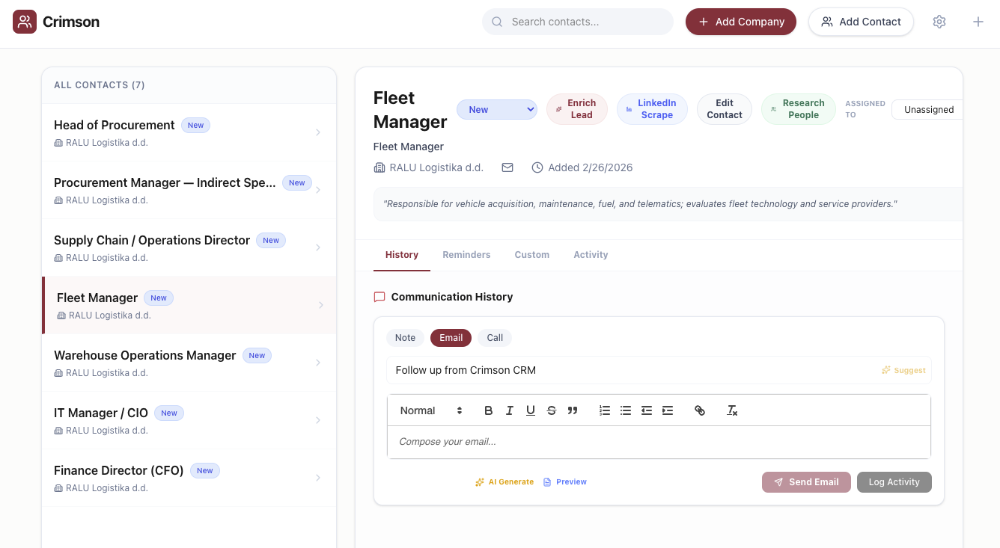

# Crimson CRM

Crimson CRM helps sales teams move faster from first contact to closed opportunity.
Track leads, enrich profiles, generate outreach, and manage follow-ups from one clean workspace.

## Product Screenshot

Add your screenshot here:

`docs/product-screenshot.png`

```md

```

## Why Crimson CRM

- Keep every lead organized with status, ownership, and activity history.
- Capture communication context in one timeline (email, notes, reminders).
- Speed up outbound with AI-assisted lead enrichment and email drafting.
- Customize lead data with your own fields as your process evolves.

## Core Features

- Lead management with searchable pipeline states.
- Contact profile view with company, website, and LinkedIn details.
- Built-in reminder system for follow-ups.
- Activity log for accountability and collaboration.
- Email sending and communication tracking.
- AI-assisted enrichment, subject line generation, and message drafting.

## Quick Start

Prerequisite: Node.js 18+

1. Install dependencies:
   `npm install`
2. Configure environment variables in `.env.local` (use `.env.example` as reference), including:
   `OPENAI_API_KEY`
   `DATABASE_PATH` (optional, defaults to `./data/crimson.db`)
3. Start the app:
   `npm run dev`
4. Open the local URL shown in your terminal.

## Deployment Note (Coolify/Docker)

For persistent SQLite storage in containers, mount a writable volume and set:

`DATABASE_PATH=/app/data/crimson.db`

## Tech Stack

- React + TypeScript + Vite
- Express API server
- SQLite (better-sqlite3)
- Tailwind CSS

## Positioning

Crimson CRM is ideal for small sales teams that need speed, clarity, and lightweight workflow automation without enterprise CRM complexity.
